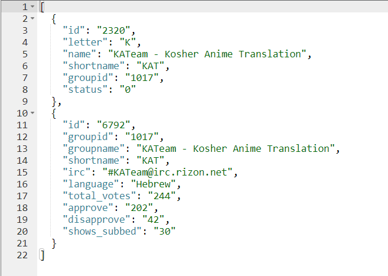

# MyAnimeList Fansub Databse
An archive of the Anime Fansub databse from [MyAnimeList](https://myanimelist.net/) as of Sep 25, 2018, which was removed from the site shortly after.  

# Why To Use?
I think that MAL/JustAnotherShiro summarized it pretty good:  
> Fansubs section removed? Now that's huge loss. Much bigger than API or clubs imo. Downloading first episode from multiple groups and comparing them myself is huge pain.

You can use this extensive database to find the best fansub suitted for you for anime up to 2018. All according to keikaku.  
**Translator's note:** keikaku means plan. 

# Why bother with Fansubs?
Nowadays, with major platforms like Crunchyroll and Netflix dominating anime streaming, fansubs have become much rarer compared to the vibrant fansub community of the early 2000s. However, they still offer several advantages over the often lackluster official English subtitles.   

- **Better handling of wordplay and puns:** Fansubs often preserve the humor and nuances of wordplay (e.g., in "Monogatari" and "OreGairu") which official subtitles struggle to convey accurately due to hyper-literal translations.  
- **Inclusion of untranslated visual elements:** Fansubs are more likely to translate on-screen text (e.g., signs and posters) that official subs often omit, enhancing understanding of visual context.  
- **Adaptation of cultural references:** Fansubs tend to maintain important Japanese cultural elements, while official subs may simplify or westernize them, reducing the authenticity of the content.  
- **More accurate translations in specific shows:** For shows like "Steins;Gate" or "Symphogear," fansubs address inconsistencies and errors in the official subs.
- **Enhanced readability and presentation:** Fansubs often include better typesetting and formatting, making it easier to follow dialogue alongside visual information, particularly in text-heavy or fast-paced scenes.  
- **【Karaoke】:** Fansubs often provide translations of song lyrics, which official subs may neglect, and there's nothing better than singing along your favorite OP!
- **Attention to detail:** Fansubbers invest considerable effort into producing accurate and detailed translations, which are often of higher quality than official releases that may be hurried or constrained by strict regulations (such as Netflix's text limitations). Additionally, fansub groups frequently offer creative and playful translations that enhance the overall viewing experience.

  
Click for examples

- Creative and playful translations  
  

- Official subs are straight up wrong

- Even the absurditties have become iconic on their own right  

- Fansub: by the fans - for the fans  

I highly recommend watching Gigguk's [Watching Anime Fansubs](https://www.youtube.com/watch?v=t_snS5DfSdg) video to get a taste of the cultural and historical phenomenon which is anime fansub.

# The archive
This is the MyAnimeList Fansubs Archive as of Sep 25, 2018. There are 3 folders in this archive: 

## scraper/
Contains PHP scripts used for scraping. You can use those scripts on [mal_pages/](MAL%20Fansubs%20Archive/mal_pages/pages) since MAL have officialy removed it from their website.

## mal_pages/
Contains untouched html pages for all 4531 groups on MAL (from https://myanimelist.net/fansub-groups.php). filenames are each group's ID from MAL. made available in case you want to cross check data (from [data/](MAL%20Fansubs%20Archive/data)) in case MAL ever return this feature (unlikely).

## data/ 
Contains parsed data from each group's page in 4 file formats: SQL, XML, JSON, CSV. All the data is parsed into a MySQL db and then used phpmyadmin's export page for all formats. was only tested import on SQL file, use others on your own. The db has 5 tables:

- **1_index:**
contains links for all letter groups. it was made for scraping, you can ignore this.

- **2_group_links:**
contains links for each group's pages. also made for scraping, you can ignore this as well.

- **groups:**
contains this info on all groups: groups name, shortname, IRC channel, language, user votes, total subbed shows

- **shows:**
contains most of the info you will need: all shows subbed by all groups. 'groupid' is from 'groups' table. 'showid' is MAL id for a show (ex. 5114 id for Fullmetal Alchemist: Brotherhood). 'name' and 'details' are self explanatory. 'approve_line' is just how many users approve a sub. This is further divided into 'total_users' and 'approve' for sorting/ranking purposes which MAL never bothered to do. 'total_comments' is how many comments that sub received. These are available in the 'comments' table.

- **comments:** 
contains all comments on every sub for every show. you can use 'groupid' and 'showid' for searching. 'comment' field contains the actual comment. 'color' is for whether a user liked a sub or not. + means like and - means dislike (red background comments).

**Note:** Each table has an "id" field. This is an autoincrement field used for ordering. It doesn't have anything to do with MAL ids.  

**Example of JSON format** for my personal favorite Fansub group - KAT

## Credits
Thanks to @IA21 u/iBzOtaku for archiving the data back in 2018, visit the Additional Information folder for more information and context.

